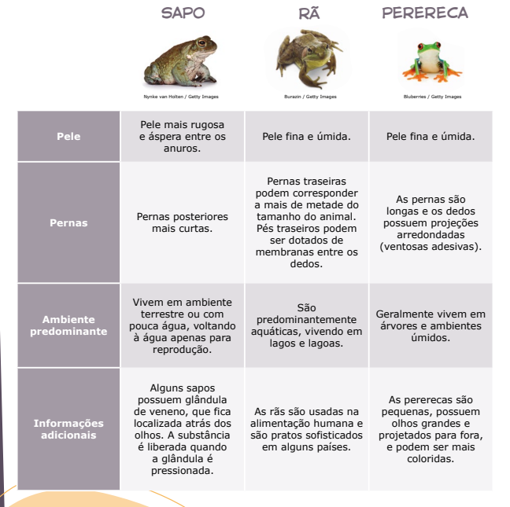

# Ciências – Capítulos 4 e 5
# Diversidade dos Animais

## Ordem de surgimento dos vertebrados:
1. **Peixes**
2. **Anfíbios**
3. **Répteis**
4. **Aves**
5. **Mamíferos**

---

## Cordados e Vertebrados

**Definição de vertebrado:** Animal que possui **coluna vertebral** e **estrutura esquelética**.

- Os vertebrados fazem parte do filo **_Chordata_** (_chorda_ = corda), pois possuem a **notocorda** na fase embrionária, ou seja, no desenvolvimento como filhotes.

---

## 🐟 Peixes

### Características

- **Primeiro grupo de vertebrados**
- **Ectotérmicos:** a temperatura corporal varia de acordo com o ambiente
- **Simetria bilateral**
- **Respiração brânquial:** a água entra pela boca e sai pelas brânquias

- **Escamas**
- **Nadadeiras**
- **Bexiga natatória:** responsável por ajudar na locomoção vertical dos peixes, inflando-se com gases

- **Linha lateral:** capta vibrações, sons e alterações de pressão, auxiliando na localização de outros seres e no nado sincronizado de cardumes

---

### Tipos de Peixes

#### 1. Agnatos

- Significa **"peixes sem mandíbula"**
- Exemplo: **Lampreia**
- Pele lisa
- Boca circular

#### 2. Cartilaginosos

- Exemplos: **Tubarões**, **Arraias** e **Quimeras**
- Mandíbula altamente desenvolvida
- Algumas espécies comem fitoplâncton, mas a maioria é **carnívora**
- **Ampolas de Lorenzini:** percebem estímulos elétricos, detectando outros seres

#### 3. Ósseos

- Exemplo: **Peixe-palhaço** 
- Possuem **estrutura esqueletica** **(Ossos)**
- **Únicos** que possuem **escamas**
- Possuem o opérculo

## 🐸 Anfibios

### Características

- **Etimologia:** do grego **_amphi_** = **duplo** + **_bios_** = **vida** → __“vida dupla”__ **(fase aquática + fase terrestre)**
- **Ectotérmicos**
- **Pele**
  - Úmida
  - fina
  - lisa
  - Sem escamas
  - Rica em glândulas
  - Bem vascularizada
- **Coração Tricavitário**
- Os **anuros** são **importantes predadores de insetos** e de suas larvas, **realizando o controle da população** desses invertebrados. A **captura das presas** por **anuros** e **urodelos** ocorre pela **projeção da língua comprida e pegajosa**. Além disso, por **passarem parte da vida na água** e **parte na terra**, eles desempenham **outro importante papel ecológico**, relacionado ao **transporte de nutrientes** do **ambiente aquático** para o **ambiente terrestre**. Outra característica **facilmente reconhecida** dos **anuros** é a **vocalização**, isto é, a **capacidade de emitir sons**, popularmente chamada de **coaxo** ou **canto**.

### Tipos de anfibios

#### Urodelos

- Ex: **Salamandra** e **Tritão**
- **Etimologia:** do grego **uro** = **Cauda** + **delos** = **visivel** → **cauda visivel**
- **Respiração**
  - Não possui pulmões
  - Respiração cutanea (pele)
  - Respiração branquial
- A cauda longa é usada para impulsionar o nado

#### *Gymnophiona*/Gimnofionas

- Ex: **Cecilias** ou **Cobra cegas**.
- **Etimologia:** do grego **gymnos** = **nu**, e **ophioneos** = **semelhante à cobra**, por não terem escamas.
- **Olhos atrofiados.**
- **Tentaculos sensoriais** auxiliam na Orientação.
- **Corpo cilindrico**
- **Sem patas (ápodes)**
- **Escavadores** ou **aquaticos**
  - Em geral, as **cecílias escavadoras** se alimentam de animais que vivem sob o solo, tais como cupins, formigas e minhocas. Elas não identificam as presas pela visão, pois, como seus olhos são muito atrofiados e muito pequenos, sua capacidade de formar imagens e de enxergar é limitada. O pequeno olho é uma adaptação para o hábito de viverem enterradas.

#### Anuros

- Ex: **rãs**, **sapos** e **pererecas**
- **Etimologia:** **An** = **Sem**, **Uro** = **Cauda**
- **Membranas interdigitais**
  - Aumentam o contato com a água, auxiliando o animal a obter uma grande propulsão na água ao contrair e relaxar as pernas
- **Pernas bem desenvolvidas**
  - possibilitaram que eles se dispersassem por uma ampla variedade de ambientes, permitindo sua presença em diversas regiões.

## 🦎 Repteis